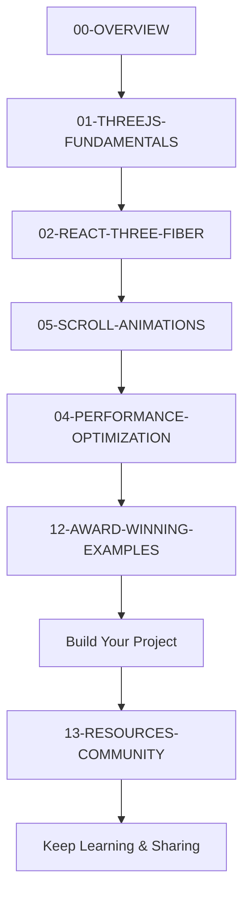

# Three.js Award-Winning Development Documentation

**Complete Knowledge Base for Building World-Class 3D Web Experiences**

---

## 🎯 Purpose

This documentation is designed to be:
- **Comprehensive**: Everything you need to know about award-winning Three.js development
- **Pervasive**: Deep explanations for genuine learning
- **AI-Ready**: Structured so future AI agents can quickly understand best practices
- **Production-Focused**: Real-world techniques used by Awwwards winners

---

## 📚 Documentation Index

### Getting Started
- **[00-OVERVIEW.md](./00-OVERVIEW.md)** - Start here! Complete guide overview and learning paths

### Core Technologies (Read in Order)
1. **[01-THREEJS-FUNDAMENTALS.md](./01-THREEJS-FUNDAMENTALS.md)**
   - Scene, Camera, Renderer basics
   - Geometry, Materials, Lighting
   - Animation loops
   - Best practices

2. **[02-REACT-THREE-FIBER.md](./02-REACT-THREE-FIBER.md)**
   - Modern React approach to Three.js
   - Declarative 3D development
   - Hooks and patterns
   - Drei helpers

3. **[04-PERFORMANCE-OPTIMIZATION.md](./04-PERFORMANCE-OPTIMIZATION.md)**
   - 60fps optimization techniques
   - Memory management
   - Instancing and LOD
   - Production best practices

4. **[05-SCROLL-ANIMATIONS.md](./05-SCROLL-ANIMATIONS.md)**
   - Lenis smooth scrolling
   - GSAP ScrollTrigger
   - Scroll-driven 3D animations
   - Award-winning patterns

### Advanced Topics
5. **[12-AWARD-WINNING-EXAMPLES.md](./12-AWARD-WINNING-EXAMPLES.md)**
   - Case studies from winners
   - Technical breakdowns
   - Common patterns
   - What makes sites win

6. **[13-RESOURCES-COMMUNITY.md](./13-RESOURCES-COMMUNITY.md)**
   - Learning resources
   - Industry leaders to follow
   - Tools and libraries
   - Communities and forums

---

## 🚀 Quick Start Paths

### Path 1: Complete Beginner (2-3 weeks)
```
Day 1-3:   Read 01-THREEJS-FUNDAMENTALS
           Build: Rotating cube with lights

Day 4-7:   Read 02-REACT-THREE-FIBER
           Build: Interactive 3D scene

Day 8-10:  Read 05-SCROLL-ANIMATIONS
           Build: Simple scroll-based animation

Day 11-14: Study 12-AWARD-WINNING-EXAMPLES
           Build: Copy one pattern you like

Week 3:    Combine everything
           Build: Mini portfolio with 3D scroll
```

### Path 2: Experienced Developer (1 week)
```
Day 1:  Skim 01, Focus on 02 (R3F)
Day 2:  Deep dive 05 (Scroll)
Day 3:  Study 04 (Performance)
Day 4:  Analyze 12 (Winners)
Day 5-7: Build prototype portfolio
```

### Path 3: Production Ready (2 weeks)
```
Week 1: Read all docs thoroughly
        Study 3-5 award-winning sites
        Build component library

Week 2: Build full portfolio/showcase
        Optimize to 60fps
        Test on all devices
```

---

## 📋 What's Covered

### Technologies
- ✅ Three.js r160+
- ✅ React Three Fiber
- ✅ @react-three/drei
- ✅ @react-three/postprocessing
- ✅ Lenis (smooth scroll)
- ✅ GSAP + ScrollTrigger
- ✅ Framer Motion
- ✅ Next.js integration

### Techniques
- ✅ Scene setup and optimization
- ✅ Camera control and animation
- ✅ Lighting and materials
- ✅ Scroll-based interactions
- ✅ Performance optimization (60fps)
- ✅ Custom shaders (basics)
- ✅ Post-processing effects
- ✅ Loading strategies
- ✅ Mobile optimization

### Patterns
- ✅ Hero section animations
- ✅ Section-based navigation
- ✅ Parallax effects
- ✅ Smooth page transitions
- ✅ Interactive 3D objects
- ✅ Progress indicators
- ✅ Loading screens

---

## 🎓 Learning Philosophy

### 1. Learn by Building
Don't just read - build alongside each section. Create small experiments to internalize concepts.

### 2. Study Winners
Analyze award-winning sites. Use DevTools to understand their techniques. Recreate patterns you admire.

### 3. Optimize Early
Performance matters from day one. Test on mobile devices. Target 60fps always.

### 4. Share Your Work
Post to communities. Get feedback. Help others. Teaching solidifies knowledge.

### 5. Iterate Constantly
Your first version won't win awards. Keep refining. Details matter.

---

## 🛠️ Required Setup

### Software
```bash
# Node.js 18+
node --version

# Package manager (choose one)
npm --version   # or
pnpm --version  # or
yarn --version

# Code editor
VS Code (recommended)
```

### VS Code Extensions
- ES7+ React/Redux/React-Native snippets
- GLSL Lint
- Shader languages support
- Prettier
- ESLint

### Browser
- Chrome/Edge (best Three.js DevTools)
- Firefox (good performance profiling)
- Safari (test on if targeting Mac/iOS)

---

## 📦 Starter Template

```bash
# Create Next.js app
npx create-next-app@latest my-3d-site --typescript

cd my-3d-site

# Install Three.js stack
npm install three @react-three/fiber @react-three/drei
npm install @react-three/postprocessing
npm install @types/three --save-dev

# Install animation libraries
npm install gsap @studio-freight/lenis
npm install framer-motion

# Install utilities
npm install zustand leva r3f-perf
```

---

## 🎯 Success Metrics

### Performance Targets
- **Desktop**: 60fps sustained
- **Mobile**: 30fps minimum
- **Initial Load**: < 3 seconds
- **Time to Interactive**: < 4 seconds
- **Lighthouse Score**: > 90

### Quality Targets
- Smooth scroll with no jank
- Meaningful, purposeful animations
- Clear navigation
- Accessible (keyboard navigation)
- Mobile responsive

### Award Potential
- Unique concept or execution
- Technical excellence
- Cohesive design system
- Memorable experience
- Portfolio-worthy

---

## 🔗 Quick Links

**Essential Resources:**
- Three.js Docs: https://threejs.org/docs/
- R3F Docs: https://docs.pmnd.rs/react-three-fiber
- Bruno's Course: https://threejs-journey.com/
- Awwwards: https://www.awwwards.com/

**Communities:**
- Three.js Forum: https://discourse.threejs.org/
- Poimandres Discord: https://discord.com/invite/poimandres
- Three.js Discord: https://discord.gg/three-js

**Inspiration:**
- Awwwards Three.js: https://www.awwwards.com/websites/three-js/
- Codrops: https://tympanus.net/codrops/
- Three.js Showcase: https://threejsresources.com/showcase

---

## 📈 Recommended Learning Order



---

## 💡 Tips for Success

1. **Start Small**
   - Don't try to build a full site immediately
   - Master one concept at a time
   - Build small experiments

2. **Study Daily**
   - Check Awwwards daily winner
   - Try one new technique per week
   - Analyze one award-winning site per week

3. **Build in Public**
   - Share work-in-progress
   - Get feedback early
   - Learn from community

4. **Optimize Always**
   - Test on real devices
   - Monitor FPS constantly
   - Performance is not optional

5. **Details Matter**
   - Easing curves
   - Timing
   - Micro-interactions
   - Polish separates good from award-winning

---

## 🤝 Contributing

Found an error? Have a suggestion? Want to add a section?

This documentation is designed to grow and improve. Contributions welcome!

---

## 📝 Document Status

**Last Updated:** October 2025  
**Version:** 1.0  
**Coverage:** Production Ready  
**Maintenance:** Active

---

**Ready to start? Begin with [00-OVERVIEW.md](./00-OVERVIEW.md) →**

---

## 📄 License

This documentation is created for educational purposes. Code examples are free to use. Referenced techniques and patterns are from publicly available award-winning websites and open-source projects.

